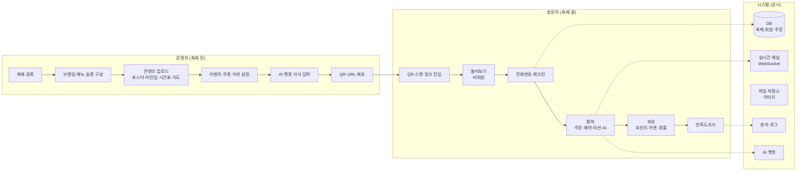

## 1. 전체 그림 (3개 층)

```mermaid
flowchart LR
  subgraph 운영자["운영자 (축제 전)"]
    A1[축제 등록] --> A2[브랜딩·메뉴 슬롯 구성]
    A2 --> A3[콘텐츠 업로드<br/>포스터·라인업·시간표·지도]
    A3 --> A4[이벤트·쿠폰·미션 설정]
    A4 --> A5[AI 챗봇 지식 입력]
    A5 --> A6[QR·URL 배포]
  end

  subgraph 방문자["방문자 (축제 중)"]
    B1[QR 스캔·링크 진입] --> B2[둘러보기<br/>비회원]
    B2 --> B3[전화번호 체크인]
    B3 --> B4[참여<br/>주문·예약·미션·AI]
    B4 --> B5[보상<br/>포인트·쿠폰·경품]
    B5 --> B6[만족도조사]
  end

  subgraph 시스템["시스템 (상시)"]
    C1[(DB<br/>축제·회원·주문)]
    C2[실시간 채널<br/>WebSocket]
    C3[파일 저장소<br/>이미지]
    C4[분석·로그]
    C5[AI 챗봇]
  end

  A6 --> B1
  B3 -.-> C1
  B4 -.-> C2
  B4 -.-> C5
  B6 -.-> C4
```
