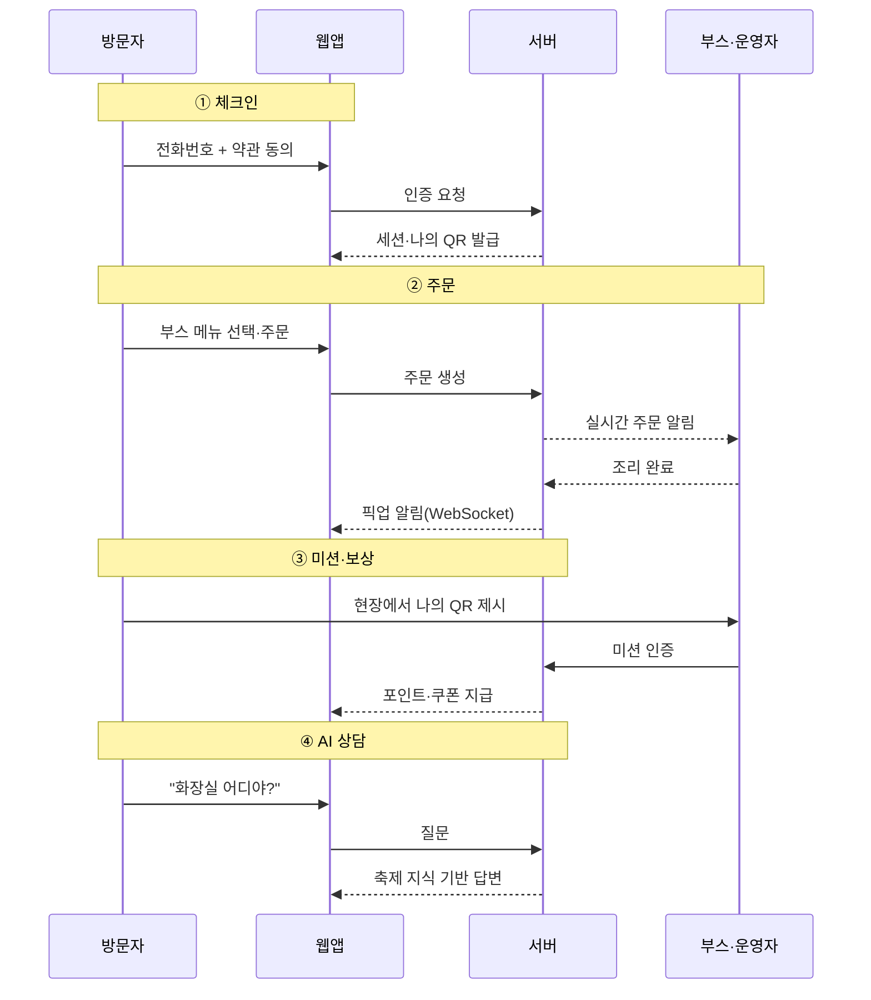

## 5. 데이터 흐름 (핵심 4가지)

```mermaid
sequenceDiagram
  participant V as 방문자
  participant W as 웹앱
  participant S as 서버
  participant B as 부스·운영자

  Note over V,W: ① 체크인
  V->>W: 전화번호 + 약관 동의
  W->>S: 인증 요청
  S-->>W: 세션·나의 QR 발급

  Note over V,B: ② 주문
  V->>W: 부스 메뉴 선택·주문
  W->>S: 주문 생성
  S-->>B: 실시간 주문 알림
  B-->>S: 조리 완료
  S-->>W: 픽업 알림(WebSocket)

  Note over V,S: ③ 미션·보상
  V->>B: 현장에서 나의 QR 제시
  B->>S: 미션 인증
  S-->>W: 포인트·쿠폰 지급

  Note over V,S: ④ AI 상담
  V->>W: "화장실 어디야?"
  W->>S: 질문
  S-->>W: 축제 지식 기반 답변
```
